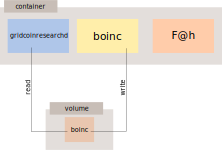

# Containerized all-in-one solution for gridcoin
This repository is intended to provide an easy setup for headless CPU crunching[^1] in the gridcoin ecosystem.
To achieve this, three containers will be enabled for
- [gridcoinresearchd](https://gridcoin.us/), the headless wallet and the blockchain *buzzword, buzzword*
- [boinc](https://boinc.berkeley.edu/), volunteer computing, support various science
- [Folding@home](https://foldingathome.org/), simulating protein dynamics to fight deseases



gridcoinresearchd and boinc share a volume, that gridcoinresearchd can keep track of the cross-project ID.

# Quickstart
## Preconditions
Make sure that the following packages are installed
- podman
- podman-compose
- make (this is just used for boinc setup instead of a shell script)

and also that the machine is configured for the user running the containers with
- lingering enabled
  ```
  loginctl enable-linger
  ```
  that the containers do not stop when the user logs out.

- enabled podman restart service
  ```
  systemctl --user start podman-restart.service
  systemctl --user enable podman-restart.service
  ```
  that the restart policy works.

*Docker might be used instead of podman. Make sure to substitute all podman commands with docker, don't forget the Makefile.*

## Clone
Clone this repository and enter its directory by running
```
git clone https://github.com/kvnglb/gridcoinresearchd-containerized.git
cd gridcoinresearchd-containerized
```
on the desired machine.

## gridcoinresearch.conf
Edit the file `./bind-mount/gridcoin/gridcoinresearch.conf` and enter a password for the rpc user

### INVESTOR MODE
Everything is done, nothing more to do.

### CRUNCHING MODE
- If you plan to also use the boinc container on that machine (does not matter whether it crunches or stays idle, when at least one project is attached), enter the email address that is/will be used for the boinc project OR
- if the cross-project ID has already settled or the wallet runs on a machine, where boinc should't run, enter the CPID manually.

## Makefile (only for crunching boinc)
*Well.. Ahm, yes. Maybe makefiles are not intended for this, anyway...*

Join the boinc projects you want to contribute to at their websites. When you cannot setup a boinc account at the projects website, skip the modification of the makefile. CLI commands of the boinc client will work once the container is running. Then, it is possbile to join projects from the boinc client and to attach the projects manually (will be explained later).

Edit the Makefile and modify the lines in `attach_projects` as wanted. The private key can be found in the respective boinc project in `Your account -> section Account information -> Account keys`. When the CPID has already settled, you can use the weak account key (recommended), otherwise you must use the other account key, that boinc can sync the cross-project ID.

## fah.xml (only for crunching Folding@home)
- Get a passkey at https://foldingathome.org/support/faq/points/passkey/
- Register at https://v8-3.foldingathome.org/ . Your user name must comply with `<name>_GRC_<CPID>`[^2]
- Edit the config `./bind-mount/fah/fah.xml`
  - Replace `TOKEN` in `<account-token>` with your token from https://v8-3.foldingathome.org/ -> Account settings and logout -> Token
  - optionally change the machine name

## Compose file
Adjust the `docker-compose.yml` file. Uncomment the lines based on your machines architecture for the gridcoin wallet and Fah. Eventually update the link, when newer versions are available: [gridcoin releases](https://github.com/gridcoin-community/Gridcoin-Research/releases) and [F@h releases](https://foldingathome.org/start-folding/)

## Start containers
At the very beginning, build the containers with
```
podman-compose build
```

Investors, who don't need boinc can skip all steps but the last one.

1. Start the boinc container (somehow the wallet has problems getting the CPID when it is started first and boinc has no attached projects; bringing-up-order can be ignored when `forcecpid` is used).
   ```
   podman-compose up -d boinc
   ```

1. Setup boinc with `make`
    - First, forbid boinc to crunch (will be later allowed again)
      ```
      make stop_crunch
      ```
    - Attach your projects, run
      ```
      make attach_projects
      ```
    - Adjust the percentage for how much CPU boinc should use. E.g a machine with 16 cores will use 8 for boinc with
      ```
      make cpu_perc perc=50
      ```
    - Allow boinc to crunch
      ```
      make start_crunch
      ```

   Alternatively to `make`, all commands from `podman exec gridcoin_boinc boinccmd --help` should work. It is possible to join and attach a project with
   ```
   podman exec gridcoin_boinc boinccmd --create_account <URL> <email> <passwd> <name>
   podman exec gridcoin_boinc boinccmd --lookup_account <URL> <email> <passwd>
   podman exec gridcoin_boinc boinccmd --project_attach <URL> <key from lookup_account>
   ```

1. Start the F@h container
   ```
   podman-compose up -d fah
   ```

1. Finally, start the wallet for gridcoinresearchd
   ```
   podman-compose up -d gridcoin
   ```

   All [rpc command](https://gridcoin.us/wiki/rpc.html) should work, but they need the prefix `podman exec gridcoin_gridcoin`. So for example to get the mining information, run
   ```
   podman exec gridcoin_gridcoin gridcoinresearchd getmininginfo
   ```
   If the output is `error: couldn't connect to server`, wait a few minutes.

## Check whether everything is working
```
podman ps -a
```
should show the three containers running.

### Gridcoin
```
tail -f bind-mount/gridcoin/debug.log
```
should show a shit load of output, especially when the chain is syncing.

```
podman exec gridcoin_gridcoin gridcoinresearchd getinfo
```
should output something, that doesn't look like an error.

### Boinc
```
htop
```
or `top` should show a higher amout of CPU usage for their container/jobs.

```
podman exec gridcoin_boinc boinccmd --get_state
```
should output something, that doesn't look like an error.

When more projects were attached
```
podman exec gridcoin_boinc boinccmd --get_state | grep -i cross
```
should show the same cross-project ID. If CPIDs do not match, wait a few days.

```
podman exec gridcoin_boinc boinccmd --get_state | grep -i job
```
Numbers should increase over time (hours to days). Ideally not the `failed` one.

### Folding@home
- The container should be visible and controllable in https://v8-3.foldingathome.org/
- When the container is folding, `htop` (or `top`) like for boinc.

## Optionally log the wallets balance
When the balance of the wallet should be automatically logged regularly, add `walletlog.sh` to the crontab with `crontab -e` and add the line
```
0 5 * * * /path/to/walletlog.sh > /dev/null 2>&1
```
This will log every day at 5 a.m. the balance, whether the wallet is able to stake and the magnitude. The file `balance.log` in the home directory of the user will look like
```
2024-05-18 05:00:02 5000.123 true 80
2024-05-25 05:00:03 5200.456 true 81
2024-05-26 05:00:03 5220.789 true 79
```

[^1]: I haven't found a comfortable way getting the GPU to work with containers.
[^2]: https://gridcoin.us/guides/foldingathome.htm

